# Tio Benny's Clínica Veterinária

## Descrição do projeto

O sistema foi feito para o gerenciamento de uma clínica veterinária, que automatiza as seguintes funções:

- Cadastro de animais;
- Geração de relatórios veterinários;
- Armazenamento do histórico médico dos animais.

O projeto foi desenvolvido principalmente na linguagem Java para a matéria de Programação Orientada a Objetos, utilizando o Spring Framework.

## Instalação e execução

Primeiramente é preciso clonar o repositório em sua máquina. Para fazer isso, acesse a página principal do repositório e clique no botão "Code" e para exibir o link e copie-o.

Através da linha de comando ou usando um IDE, faça a clonagem. Usando o Intellij como exemplo, feche qualquer projeto que esteja aberto, clique em "Get from VCS", cole o link no campo URL, escolha a pasta em que deseja clonar e clique em "Clone" na parte inferior da tela.

Execute a classe "CareApplication" e acesse no navegador o endereço da aplicação, que é _localhost:8080_.

## Como usar

Na tela inicial você verá alguns gráficos e estatísticas dos atendimentos da clínica,
além dos botões para ir à aba "animais" e a barra de pesquisa.

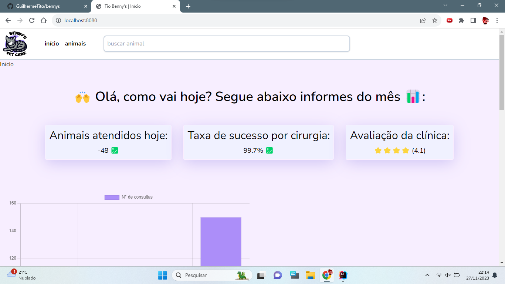

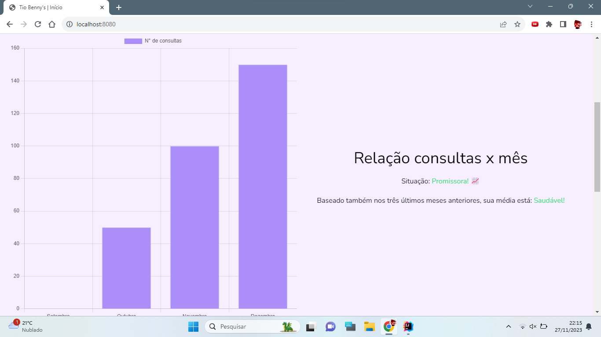

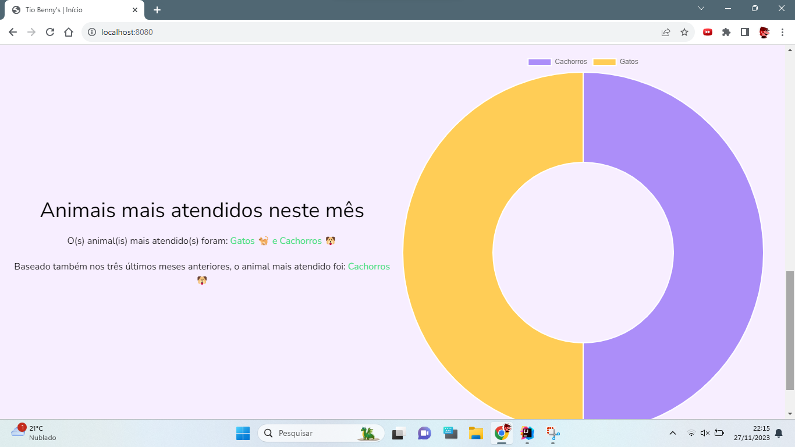

Na aba "Animais", você verá uma lista dos animais cadastrados. Neste caso, ainda não há nenhum animal cadastrado.

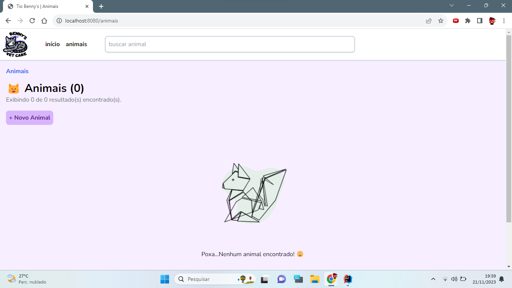

Ao clicar em "Novo animal", será apresentada a ficha de cadastro de animal. Podem ser cadastrados cães e gatos, e
cada um tem um atributo especial. Cães possuem "raça" e gatos possuem "tipo de pelagem".

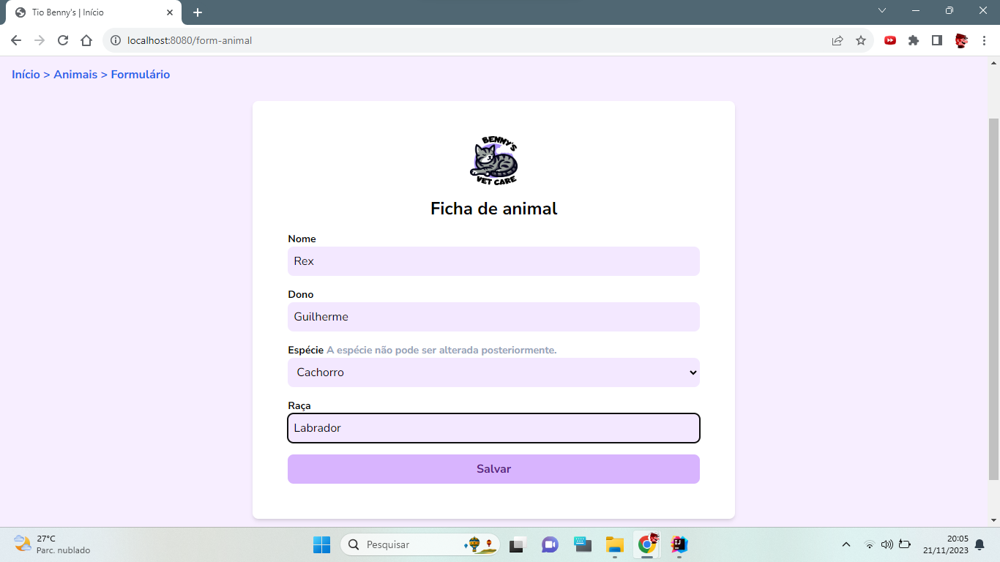

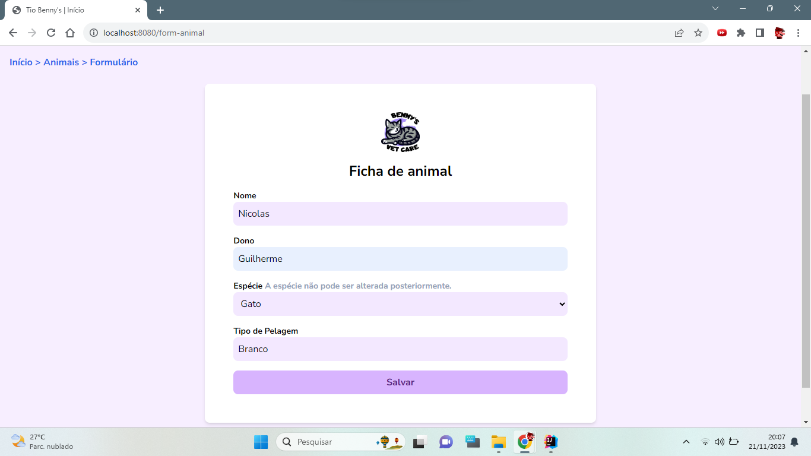

Ao clicar em salvar, você será redirecionado à aba "Animal" novamente, onde agora há registros de animais.

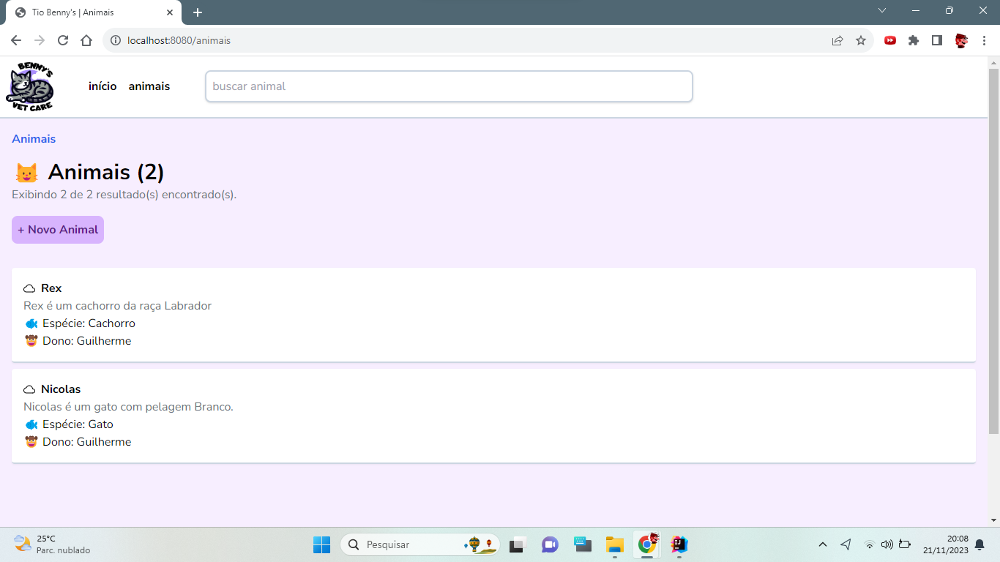

Ao clicar em um animal é possível ver os dados de seu registro.

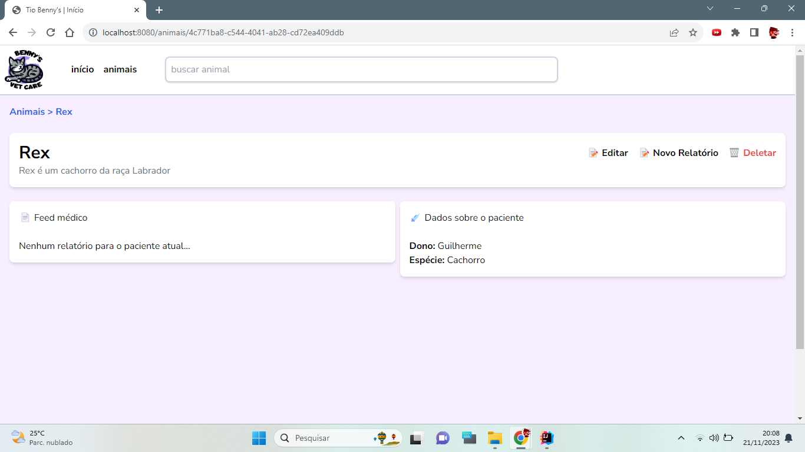

É possível fazer um relatório médico clicando em "Novo Relatório".

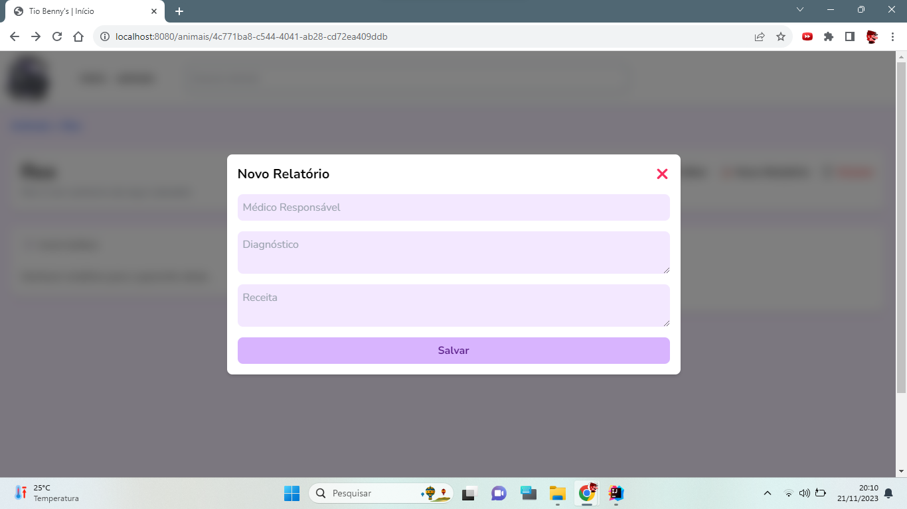

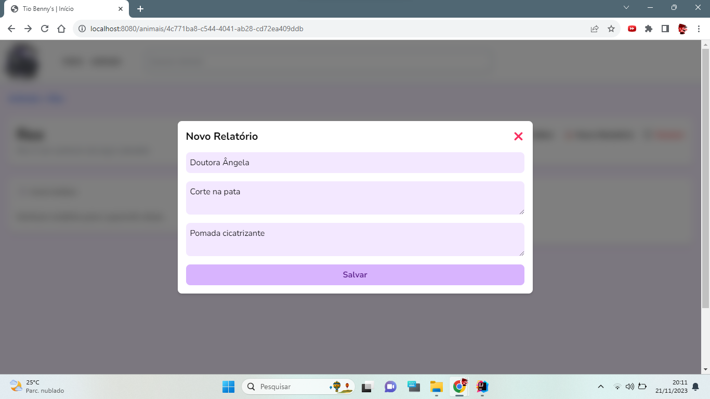

Após cadastrar um relatório, ele aparecerá no "Feed Médico", com os relatórios mais recentes no topo.

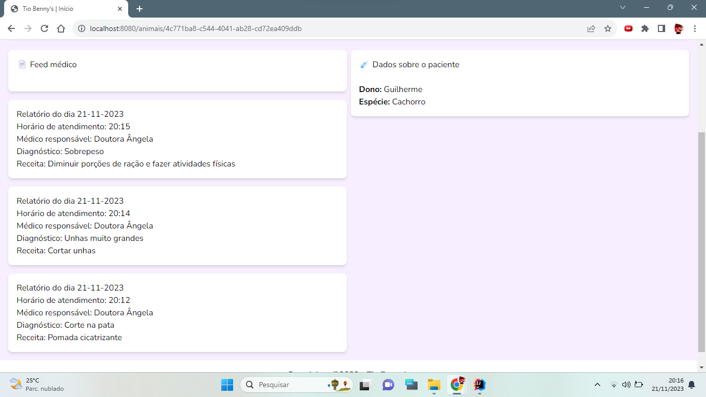

Para excluir o registro de um animal, clique em "Deletar". Um pop-up aparecerá para que a decisão seja
confirmada.

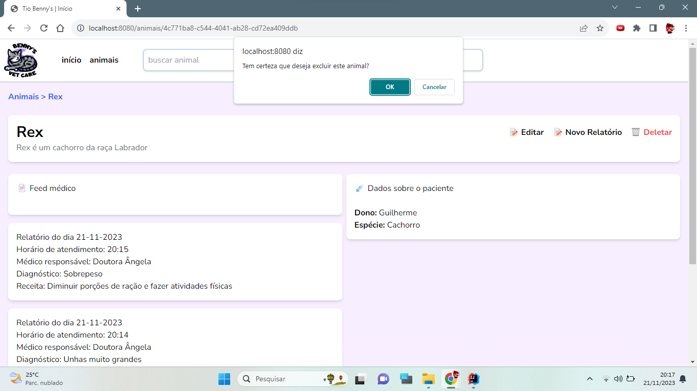

## Desenvolvido por:

- Guilherme Ferraz Ronha
- Matheus Biazotto
- Matheus Manzoli
- Raíne Felix
- Tiago Ferreira

Professor: Marcos Roberto de Morais
